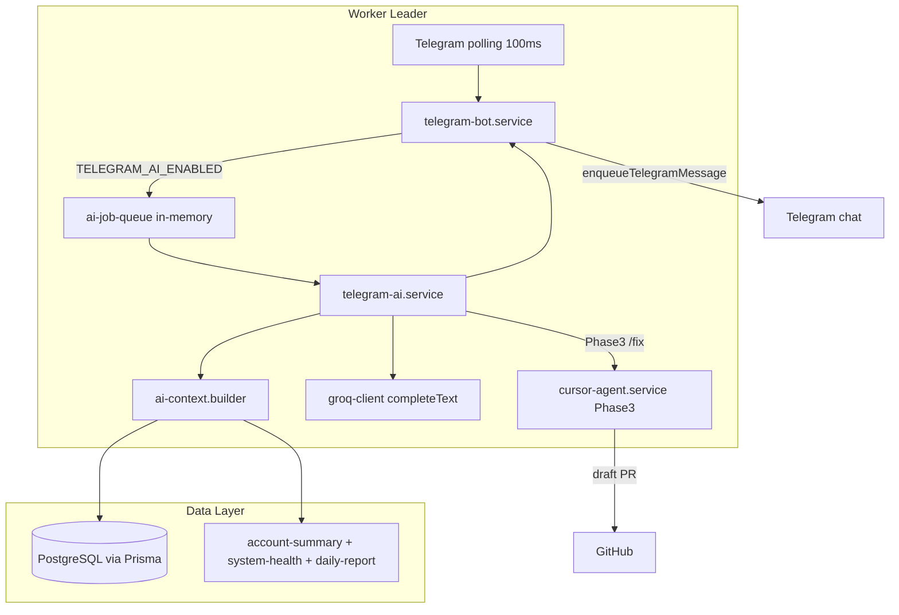
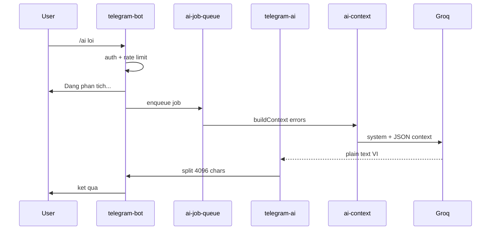
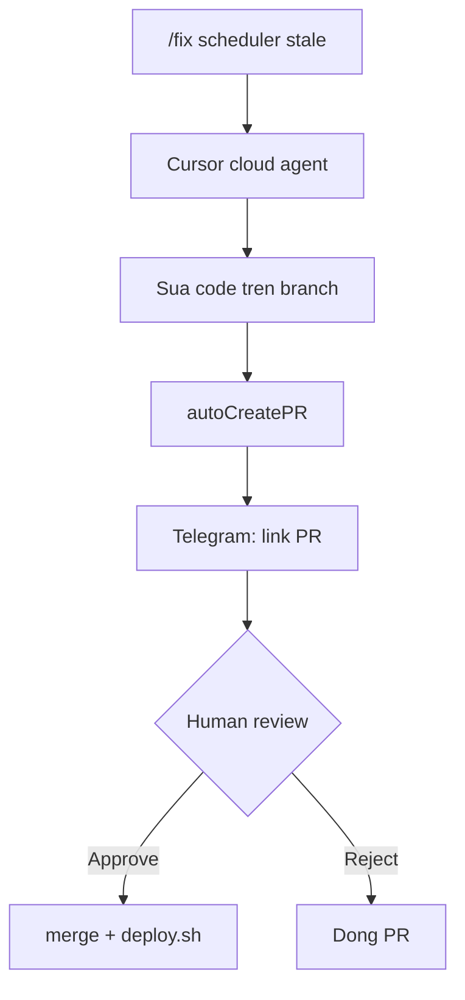

# Kế hoạch — Telegram AI Q&A (`/ai`, `/fix`)

> **Trạng thái:** Implemented (Phase 0–4)  
> **Phạm vi:** 4 phase (MVP Groq → Q&A nâng cao → Cursor `/fix` → vận hành)  
> **Liên quan:** [`telegram-bot-checklist.md`](./telegram-bot-checklist.md), [`telegram-bot-notifications.md`](./telegram-bot-notifications.md)

## Tóm tắt

Triển khai AI hỏi đáp trên Telegram bot hiện có:

- **Phase 1 (MVP):** lệnh `/ai` dùng **Groq** + context từ DB/services — phân tích run hôm nay, lỗi, pipeline, LLM.
- **Phase 2:** hỏi tự do `/ai vi ...`, session memory, so sánh, `/logs`.
- **Phase 3:** lệnh `/fix` qua **Cursor SDK** (cloud agent) → draft PR trên GitHub — **không** auto-deploy.
- **Phase 4:** monitor, tune prompt, runbook.

**Cursor AI:** có thể tích hợp qua `@cursor/sdk`, nhưng chỉ cho Phase 3 (sửa code + PR). Q&A hàng ngày dùng Groq (đã có sẵn, nhanh, rẻ).

---

## Checklist triển khai

### Phase 0 — Chuẩn bị

- [x] `backend/src/config/telegram-ai.ts`
- [x] `validateTelegramAiConfig()` trong `backend/src/config/app.ts`
- [x] Biến env trong `backend/.env.example`
- [x] Spec doc: file này
- [x] Cập nhật `backend/ecosystem.config.cjs` (nếu cần inject env AI)

### Phase 1 — MVP `/ai`

- [x] `completeText()` trong `backend/src/services/groq-client.ts`
- [x] `backend/src/services/telegram/ai-context.builder.ts`
- [x] `backend/src/services/telegram/ai-prompts.ts`
- [x] `backend/src/services/telegram/ai-job-queue.ts`
- [x] `backend/src/services/telegram/telegram-ai.service.ts`
- [x] Wire `/ai` trong `telegram-bot.service.ts` + `HELP_TEXT`
- [x] `backend/tests/unit/telegram-ai-context.test.ts`
- [ ] Manual test trên Telegram

### Phase 2 — Q&A nâng cao

- [x] `/ai vi <câu hỏi>` + session memory (3 lượt)
- [x] `/ai so sanh`, `/ai cancel`, `/logs`
- [x] Optional: model `AiSession` trong Prisma
- [x] Optional: `TelegramAiPanel` trên dashboard

### Phase 3 — Cursor `/fix`

- [x] `@cursor/sdk` dependency
- [x] `cursor-agent.service.ts`
- [x] `/fix`, `/fix status`, `/deploy?`
- [x] Model `AiFixJob` trong Prisma
- [x] Env + doc trong `docs/deployment.md`

### Phase 3b — Cursor `/cursor` (chat tự do)

- [x] `cursor-chat.service.ts` — cloud agent, `autoCreatePR: false`
- [x] `cursor-job-queue.ts` — timeout 5 phút, 1 job/chat
- [x] Model `AiCursorSession` — resume agent ~24h
- [x] `/cursor`, `/cursor new`, `/cursor status`, `/cursor cancel`
- [x] Admin-only mặc định (`CURSOR_CHAT_ADMIN_ONLY=true`)
- [x] Tests `cursor-chat.service.test.ts`

### Phase 4 — Vận hành

- [x] Monitor cost Groq/Cursor
- [x] Tune prompts
- [x] Runbook trong `docs/v3-operations.md`

---

## Hiện trạng (điểm tựa)

Bot Telegram **đã chạy** trong worker leader (`backend/src/worker.ts` L156–159), long polling 100ms (`telegram-bot.service.ts`).

| Thành phần | File | Ghi chú |
|------------|------|---------|
| Auth chat/user | `backend/src/config/telegram.ts` | `isChatAllowed`, `isUserAllowed` |
| Lệnh hiện có | `telegram-bot.service.ts` | `/show`, `/baocao`, `/pipeline`, ... |
| Báo cáo ngày | `daily-report.ts` | Template data cho `/ai` |
| Health + lỗi | `system-health.service.ts` | `getSystemHealthSnapshot()`, `recentErrors` |
| PnL / W-L | `account-summary.service.ts` | `getTodayTradeStatsIct()` |
| Groq client | `groq-client.ts` | `analyze()` — **chỉ parse JSON**, cần thêm `completeText()` |
| Cursor SDK | Chưa có | `@cursor/sdk` cloud agent cho Phase 3 |

**Không có model `Run` riêng** — "run hôm nay" = chu kỳ MarketScan → LLMDispatch → executeV3Trade + kết quả trong `trade_decisions`, `testnet_trade_events`, `testnet_positions`.

---

## Kiến trúc tổng thể





---

## Phase 0 — Chuẩn bị (0.5 ngày)

### Config mới

Tạo `backend/src/config/telegram-ai.ts`:

```typescript
export interface TelegramAiConfig {
  enabled: boolean;
  model: string;
  maxTokens: number;
  rateLimitPerUserHour: number;
  rateLimitPerChatDay: number;
  requireAllowedUserIds: boolean; // production: true khi AI enabled
}
```

- `TELEGRAM_AI_ENABLED=false` (default) — tách khỏi `TELEGRAM_ENABLED`
- Gọi `validateTelegramAiConfig()` từ `backend/src/config/app.ts`
- Khi `TELEGRAM_AI_ENABLED=true` trong production: **bắt buộc** `TELEGRAM_ALLOWED_USER_IDS` không rỗng

### Env vars — thêm vào `backend/.env.example`

```bash
# Telegram AI Q&A
TELEGRAM_AI_ENABLED=false
TELEGRAM_AI_MODEL=meta-llama/llama-4-scout-17b-16e-instruct
TELEGRAM_AI_MAX_TOKENS=2048
TELEGRAM_AI_RATE_LIMIT_PER_USER_HOUR=5
TELEGRAM_AI_RATE_LIMIT_PER_CHAT_DAY=30

# Phase 3 — Cursor Agent
# CURSOR_AGENT_ENABLED=false
# CURSOR_API_KEY=cursor_...
# CURSOR_AGENT_MODEL=composer-2.5
# CURSOR_AGENT_REPO_URL=https://github.com/org/chuyen-gia-crypto
# CURSOR_AGENT_BASE_BRANCH=develop
```

---

## Phase 1 — MVP `/ai` (2–3 ngày)

### 1.1 Groq text completion

Mở rộng `groq-client.ts`:

- Thêm `GroqTextRequest` + method `completeText()` trả về `string` (không qua `cleanJSONResponse`)
- Dùng `max_tokens` từ `TELEGRAM_AI_MAX_TOKENS`
- `temperature: 0.3`, `preferredModels: [TELEGRAM_AI_MODEL]`
- Log prefix `[GroqOps]` — tách khỏi trading dispatch

### 1.2 Context builder

Tạo `backend/src/services/telegram/ai-context.builder.ts`:

```typescript
export type AiContextScope = 'today_run' | 'errors' | 'pipeline' | 'llm' | 'freeform';

export interface AiContextBundle {
  meta: { generatedAt: string; ictDate: string; symbol: string; methodId: string };
  account: /* AccountBalanceSummary */;
  todayTrades: /* TodayTradeStats */;
  health: /* SystemHealthSnapshot */;
  llm: { stats; topNoTradeReasons };
  recentDecisions: /* TradeDecision[], limit 20, today ICT */;
  recentErrors: /* filtered events */;
  openPositions: /* OpenPositionLine[] */;
  pendingOrders: /* PendingOrderLine[] */;
}
```

**Tái sử dụng** (không duplicate):

- `getAccountBalanceSummary`, `getTodayTradeStatsIct`, `getOpenPositionLines`, `getPendingOrderLines`
- `getSystemHealthSnapshot`, `getLlmStatsTodayIct`, `getTopNoTradeReasonsIct`
- Timezone ICT qua `utils/ict-time.ts`

**Prisma queries bổ sung:**

- `trade_decisions`: `method_id`, `timestamp >= dayStart ICT`, `take: 20`
- `testnet_trade_events`: filter `error|reject|fail|execution_blocked|protective_failed`, `take: 15`

**Redaction:**

- Denylist: API keys, `Bearer`, `sk-`, `cursor_`, `DATABASE_URL`, `BINANCE_API_SECRET`
- Truncate `event_data` / `reason` tối đa 500 chars
- Không gửi raw `.env`

### 1.3 System prompts

Tạo `backend/src/services/telegram/ai-prompts.ts`:

- System prompt tiếng Việt: ops analyst, chỉ dựa JSON context, cite số liệu
- Template theo scope: `today_run`, `errors`, `pipeline`, `llm`

### 1.4 Job queue

Tạo `backend/src/services/telegram/ai-job-queue.ts`:

- In-memory queue + `setImmediate`
- 1 job active per `chatId`
- Timeout 60s
- Log: `[TelegramAI] job.id=... scope=... durationMs=...`

### 1.5 Orchestrator

Tạo `backend/src/services/telegram/telegram-ai.service.ts`:

```typescript
export async function handleAiCommand(
  chatId: string,
  userId: string | undefined,
  args: string
): Promise<void>
```

Flow:

1. Check `TELEGRAM_AI_ENABLED`, rate limit
2. Parse args → scope (mặc định `today_run`)
3. Reply ack: "Đang phân tích..."
4. Enqueue → `buildContext` → `completeText` → format
5. Chia message ≤ 4096 ký tự
6. HTML-safe qua `escapeHtml`

### 1.6 Lệnh Telegram (Phase 1)

| Lệnh | Scope |
|------|-------|
| `/ai` | `today_run` |
| `/ai hom nay` | `today_run` |
| `/ai loi` | `errors` |
| `/ai pipeline` | `pipeline` |
| `/ai llm` | `llm` |

Wire trong `telegram-bot.service.ts`; truyền `userId` từ `processUpdate` xuống `handleCommand`.

### 1.7 Rate limiting

- `userId → timestamps[]` (rolling 1h)
- `chatId → count/day` (reset ICT midnight)

### 1.8 Tests

`backend/tests/unit/telegram-ai-context.test.ts` — context shape, redaction, message split, scope parsing.

**Done khi:** `/ai` trả lời tiếng Việt từ dữ liệu DB thật; không block polling; rate limit hoạt động.

---

## Phase 2 — Q&A nâng cao (2–3 ngày)

### Lệnh bổ sung

| Lệnh | Mô tả |
|------|-------|
| `/ai vi <câu hỏi>` | Free-form + full context |
| `/ai so sanh` | Hôm nay vs 7 ngày |
| `/ai cancel` | Hủy job đang chạy |
| `/logs` | 30 dòng `worker-error.log` (admin only, redacted) |

### Session memory

- `Map<chatId, { turns, updatedAt }>` — 3 lượt, TTL 2h
- Optional Prisma `AiSession` nếu cần persist qua restart

### Optional frontend

- `frontend/app/sections/TelegramAiPanel.tsx` — mirror `/ai` qua internal API

---

## Phase 3 — Cursor Agent `/fix` (3–5 ngày)

### Khả thi

| Khả năng | Phương án | Ghi chú |
|----------|-----------|---------|
| Phân tích + gợi ý fix | Groq (Phase 1) | Read-only, nhanh |
| Sửa code + tạo PR | `@cursor/sdk` cloud | 2–10+ phút |
| Local agent trên VPS | Không | 1GB RAM, OOM risk |
| Auto-merge / auto-deploy | Không | Human gate |

### Service

`backend/src/services/telegram/cursor-agent.service.ts`:

- Runtime **cloud** (`cloud: { repos: [{ url, branch }] }`)
- `autoCreatePR: true`
- Prompt: mô tả bug + `recentErrors`
- **Không** mount VPS `.env`

### Lệnh

| Lệnh | Hành vi |
|------|---------|
| `/fix <mô tả>` | Khởi tạo cloud agent |
| `/fix status` | Trạng thái + link PR |
| `/deploy?` | Hướng dẫn merge + `deploy.sh` thủ công |



**Cần human approval:** merge, deploy, `BINANCE_*`, risk policy, schema migration.

---

## Phase 3b — Cursor `/cursor` (chat tự do)

Cloud agent đọc **toàn bộ repo** — hỏi code, kiến trúc, debug, giải thích bất cứ gì. Khác `/ai` (Groq + DB) và `/fix` (tạo PR).

| Lệnh | Hành vi |
|------|---------|
| `/cursor <câu hỏi>` | Chat tiếp (resume agent ~24h) |
| `/cursor new` | Phiên mới |
| `/cursor new <câu hỏi>` | Phiên mới + hỏi luôn |
| `/cursor status` | Agent ID + TTL |
| `/cursor cancel` | Hủy job đang chạy |

| | `/ai` | `/cursor` | `/fix` |
|--|-------|-----------|--------|
| Engine | Groq | Cursor cloud | Cursor cloud |
| Đọc repo | Không | Có | Có |
| Tạo PR | Không | Không | Có |
| Tốc độ | ~5s | 1–5 phút | 2–10+ phút |
| Ai dùng | Allowed users | Admin (mặc định) | Admin |

**Files:** `cursor-chat.service.ts`, `cursor-job-queue.ts`, `cursor-cloud-options.ts`, Prisma `AiCursorSession`.

**Env:** `CURSOR_CHAT_ENABLED`, `CURSOR_CHAT_ADMIN_ONLY`, `CURSOR_CHAT_RATE_LIMIT_PER_USER_HOUR`, `CURSOR_CHAT_JOB_TIMEOUT_MS`.

---

## Phase 4 — Vận hành

- Monitor Groq/Cursor cost
- Tune prompts (`TELEGRAM_AI_SYSTEM_PROMPT_VERSION`)
- Alert worker OOM
- Cân nhắc webhook Telegram (cần HTTPS trên API)
- Runbook `docs/v3-operations.md`

---

## Bảo mật

| Rủi ro | Biện pháp |
|--------|-----------|
| Bot public | `TELEGRAM_ALLOWED_USER_IDS` bắt buộc (production + AI enabled) |
| Lộ secrets | Redact trong context builder |
| Prompt injection | Sanitize/truncate `event_data` |
| Abuse / cost | Rate limit; `TELEGRAM_AI_ENABLED=false` default |
| AI sửa production | Cloud agent chỉ GitHub; PR cần review |
| Auto trading | Read-only; không gọi `executeV3Trade` |

---

## Rủi ro kỹ thuật

| Rủi ro | Giảm thiểu |
|--------|------------|
| Worker OOM | Queue async; timeout 60s; 1 job/chat |
| Groq rate limit | Key rotation + backoff |
| Hallucination | Prompt: chỉ dựa JSON context |
| JSON parse fail | `completeText()` riêng cho ops Q&A |
| Polling block | Không `await` LLM trong `handleCommand` |

---

## File thay đổi theo phase

### Phase 1

| File | Hành động |
|------|-----------|
| `backend/src/config/telegram-ai.ts` | Tạo mới |
| `backend/src/config/app.ts` | Validate |
| `backend/src/services/groq-client.ts` | `completeText()` |
| `backend/src/services/telegram/ai-context.builder.ts` | Tạo mới |
| `backend/src/services/telegram/ai-prompts.ts` | Tạo mới |
| `backend/src/services/telegram/ai-job-queue.ts` | Tạo mới |
| `backend/src/services/telegram/telegram-ai.service.ts` | Tạo mới |
| `backend/src/services/telegram/telegram-bot.service.ts` | Wire `/ai` |
| `backend/.env.example` | Env AI |
| `backend/tests/unit/telegram-ai-context.test.ts` | Tests |

### Phase 2+

| File | Hành động |
|------|-----------|
| `backend/prisma/schema.prisma` | `AiSession`, `AiFixJob` |
| `frontend/app/sections/TelegramAiPanel.tsx` | Tùy chọn |

### Phase 3

| File | Hành động |
|------|-----------|
| `backend/package.json` | `@cursor/sdk` |
| `backend/src/services/telegram/cursor-agent.service.ts` | Tạo mới |
| `docs/deployment.md` | Env Cursor |

### Không sửa logic core

- `account-summary.service.ts`, `system-health.service.ts`, `daily-report.ts`
- Trading pipeline / `executeV3Trade`

---

## Bước tiếp theo

1. Review file này + checklist từng phase
2. Khi OK → implement **Phase 0 + Phase 1** trước
3. Bật trên VPS: `TELEGRAM_AI_ENABLED=true` + `TELEGRAM_ALLOWED_USER_IDS` (sau khi test local)
