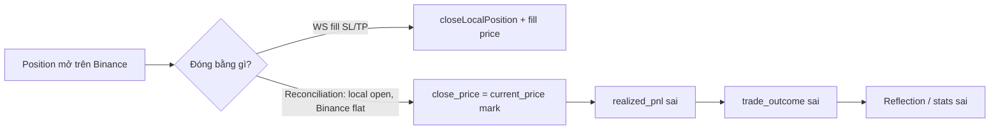

# PnL+ Roadmap (fix & cải thiện)

**Cập nhật:** 2026-06-04  
**Bối cảnh:** P0/P1 đã deploy. Wallet reconcile khớp Binance; PnL **từng position / win-rate** trong DB vẫn sai do close path ước lượng.

---

## Tracking (updated 2026-06-04)

**Checklist + snapshot số live:** [pnl-plus-tracking.md](./pnl-plus-tracking.md)

| Chỉ số (VPS live) | Giá trị |
|-------------------|---------|
| walletPnl | −$34.27 |
| dbPositionPnlSum | −$23.09 (post-phantom zero) |
| dbPositionPnlGap | −$11.18 (abs $11.18; `dbPositionPnlTrusted`: false; ≈ fees $13.06 + funding $0.15) |
| Fill-verified closes | ~83% (19/23) |
| Blocker chính | `dbPositionPnlTrusted` (fee-aware gap); frontend Vercel chưa push |

---

## Trạng thái hiện tại

| Lớp | Trạng thái | Ghi chú |
|-----|------------|---------|
| Phòng thủ (P0) | ✅ | Monitor defer SL/TP, trend guard, cooldown, exposure % |
| Pending lifecycle (P1) | ✅ code | TTL/drift/review — ít khi kích hoạt (limit fill nhanh) |
| Wallet ↔ Binance | ✅ | `wallet-reconcile`, baseline $5k, gap ≈ 0 |
| Position PnL / outcomes | ❌ | ~100% `reconciliation_closed_not_on_binance`, mark price |
| Reflection / học từ outcomes | ⚠️ | Có data nhưng **không đáng tin** cho tối ưu |
| Dashboard win-rate | ⚠️ | DB sum −$23 vs wallet −$34 (gap ~$11 phí/funding); dùng wallet-first API |

**Quy tắc đo lường tạm thời:** Dùng `wallet − starting_balance` và Binance income (`REALIZED_PNL`, phí, funding). **Không** dùng sum `testnet_positions.realized_pnl` hay win% DB để đánh giá edge.

---

## Nguyên nhân gốc (root cause)



Reconciliation đóng đúng hướng (không phantom) nhưng **giá đóng = mark tại thời điểm poll**, không phải avg fill từ `userTrades` / income.

---

## Ưu tiên

### P1.6 — Protective orders (fill-accurate SL) — **IMPLEMENTED 2026-06-04**

| # | Task | Status |
|---|------|--------|
| 1.6.1 | Entry/SL/TP từ `avgPrice` fill + `resolveLevelsForFill` | ✅ |
| 1.6.2 | Recompute SL khi fill trượt so với limit | ✅ `protective-order.service.ts` |
| 1.6.3 | `-2021` → retry SL theo mark; fail → `protective_failed_market_close` | ✅ |
| 1.6.4 | Reconciliation gọi `placeProtectiveOrdersForPosition` (không skip im lặng) | ✅ |
| 1.6.5 | `POSITION_MONITOR_EXIT_ON_UNHEDGED` (default true) + `sl_progress ≥ 95%` | ✅ |
| 1.6.6 | WS lookup retry + `clientOrderId` `x-v3_*` | ✅ |

**Env:** `POSITION_MONITOR_EXIT_ON_UNHEDGED` (default không set = bật), `SL_PLACEMENT_MARK_BUFFER_PCT=0.001`

---

### P1.5 — Quick wins (1–3 ngày) — **IMPLEMENTED 2026-06-02**

| # | Task | Status |
|---|------|--------|
| 1.5.1 | Close từ `userTrades` (`binance-fill-pnl.service.ts` → `closeLocalPosition`) | ✅ |
| 1.5.2 | `npm run testnet:reconcile-position-pnl` | ✅ |
| 1.5.3 | Orphan algo cleanup mỗi reconciliation cycle | ✅ |
| 1.5.4 | Dashboard `walletPnl`, `binanceRealizedPnl`, `dbPositionPnlSum` | ✅ |
| 1.5.5 | Skip reflection khi fill chưa verified | ✅ |

**Phụ thuộc:** Binance Demo `userTrades` hoạt động; `income` trả 200 nhưng **0 rows** trên demo (2026-06-10 probe). Metadata (`/fapi/v3/balance|account|positionRisk`, `listenKey`) **-1109 cố định** dù wallet đã kích hoạt — dùng local ledger + userTrades fallback.

### P1.7 — Binance Demo -1109 (metadata vs trading) — **2026-06-10**

| Endpoint | Demo | Ghi chú |
|----------|------|---------|
| `openOrders`, `openAlgoOrders`, `userTrades`, `order/test` | ✅ | Trading probe authoritative |
| `/fapi/v2|v3/balance`, `account`, `positionRisk` | ❌ -1109 | v2 và v3 đều fail — không phải version bug |
| `listenKey`, `positionSide/dual`, `income` rows | ❌ / rỗng | WS stream không khả dụng; wallet reconcile skip |
| Code | ✅ | exposure→userTrades; balance sync→local ledger; account-health soft gate |

**Chấp nhận trên demo:** Không wallet reconcile từ Binance; đo PnL qua `userTrades` + local delta. **Mainnet:** metadata endpoints hoạt động bình thường.

---

### P2 — Measurement loop đúng (1–2 tuần)

Mục tiêu: Mọi close đều đo được; sample ≥30 trades trước khi tune LLM.

| # | Task | Mô tả | Tiêu chí |
|---|------|--------|----------|
| 2.1 | **Verified close taxonomy** | `close_reason`: `binance_sl`, `binance_tp`, `binance_market`, `binance_liquidation`, `manual`, `reconciliation_fill` (có trade ids) | ≥95% close có `binance_fill_ids` hoặc income row |
| 2.2 | **Income-attributed close** | Khi reconcile flat: lấy `REALIZED_PNL` trong `[entry_time, close_time]` gán vào `position_id` | Sum position PnL ≈ wallet delta (±1%) |
| 2.3 | **WS ORDER_TRADE_UPDATE** | Đảm bảo mọi fill cập nhật `executed_qty`, `avg_entry` trước khi close DB | Không close local khi Binance còn qty > 0 |
| 2.4 | **Pending lifecycle E2E test** | Test/integration: limit không fill 4h → TTL cancel; drift 0.8% | Log + Telegram `ttl_expired` / `price_drift` |
| 2.5 | **LLM modify → exchange** | `modify` pending đổi giá trên Binance (cancel + replace limit) hoặc tắt `modify` trong prompt | Không còn DB-only modify |
| 2.6 | **Orphan limit recovery** | Binance LIMIT + `clientOrderId` `x-v3_*` → tạo `testnet_pending_orders` | Không mất track khi DB write fail |

**File chính:** `binance-websocket-sync.ts`, `position-close.service.ts`, `binance-reconciliation.ts`, `pending-order-actions.ts`.

---

### P3 — Defensive + chất lượng entry (2–4 tuần)

Mục tiêu: Giảm overtrade khi đã đo đúng.

| # | Task | Dựa trên evidence |
|---|------|-------------------|
| 3.1 | **HTF guard linh hoạt** | Nhiều ngày 1h PASS nhưng block `V3_REQUIRE_HTF_TREND`; cân nhắc `1h trend OR 15m trend` cho 5m/15m entries |
| 3.2 | **Cooldown từ Binance PnL** | Cooldown khi **2 loss liên tiếp theo income**, không theo DB position sum |
| 3.3 | **Duplicate exposure guard** | Reconciliation đã merge dupes — thêm pre-check trước `executeV3Trade` (Binance position + pending notional) |
| 3.4 | **R:R enforcement post-LLM** | Log cho thấy `expected_rr` corrected thường xuyên — reject nếu sau widen vẫn < 2 |
| 3.5 | **Regime dashboard** | % thời gian range vs trend; correlate với wallet PnL theo ngày |

---

### P4 — Learning loop (sau ≥30 verified closes)

| # | Task | Điều kiện |
|---|------|-----------|
| 4.1 | Bật lại reflection cho verified outcomes only | P2.1 xong |
| 4.2 | Auto-block playbook từ `trade_outcomes` (regime, TF, side) | ≥30 samples, expectancy CI |
| 4.3 | Telegram / daily report từ wallet PnL + verified stats | P2.4 dashboard |

**Không làm sớm:** Tăng size, bật thêm symbol trực tiếp, đổi model Groq chính — dễ overfit noise.

**Multi-symbol exception:** ETH/SOL chỉ được thêm qua rollout có kiểm soát với symbol-specific volume pools, testbed riêng từng symbol, và correlation guard. Xem [multi-symbol-volume-pools.md](./multi-symbol-volume-pools.md).

---

## Thứ tự triển khai đề xuất

```
Tuần 1:  P1.5.1 → 1.5.2 → 1.5.4 → 1.5.5
Tuần 2:  P2.1 + 2.2 + 2.3
Tuần 3:  P2.4 + 2.5 + 2.6, chạy paper 7 ngày chỉ đo
Tuần 4+: P3 theo metric tuần 3; P4 khi đủ sample
```

---

## Tiêu chí thành công (4 tuần)

| Metric | Target |
|--------|--------|
| `wallet − starting` vs sum income net trading | < 1% lệch |
| % close có fill proof | ≥ 95% |
| `posSum` vs `binance_realized` | < 5% lệch (sau backfill) |
| Monitor reduce/exit | 0 |
| Phantom reopen | 0 |
| Pending TTL tested | ≥1 cancel log trong staging |
| Quyết định strategy | Chỉ sau ≥30 verified closes |

---

## Việc không làm (tránh lãng phí)

- Tối ưu prompt Groq dựa trên win-rate DB hiện tại  
- Tăng `MAX_EXPOSURE_PCT` khi wallet âm  
- Bật ETH/SOL vào cùng pool BTC `$2,000`
- Bật `POSITION_MONITOR_ALLOW_EXIT` để “cứu” lệnh  
- Backfill lại toàn bộ outcomes mà không có userTrades  

---

## Lệnh vận hành (hiện có)

```bash
cd backend
npm run testnet:reconcile-wallet
npm run testnet:reconcile-wallet -- --cleanup-algo
npm run testnet:backfill-pnl -- --dry-run
```

---

## Tham chiếu

- [pnl-plus-tracking.md](./pnl-plus-tracking.md) — checklist + snapshot (cập nhật định kỳ)  
- [pnl-plus-p0-plan.md](./pnl-plus-p0-plan.md) — P0 đã xong  
- [pnl-backfill.md](./pnl-backfill.md) — backfill + wallet  
- [pending-order-lifecycle.md](./pending-order-lifecycle.md) — TTL/drift/review  
