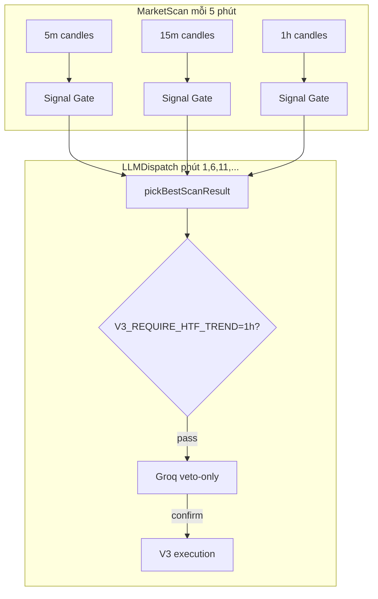

# V3 — Chuyển Signal Gate sang 5m + Reset DB

**Status:** Implemented (2026-05-23) — code, env, DB reset script, deploy VPS  
**Current baseline note (2026-07-11):** production BTC gate is stricter than this experiment: `MIN_SIGNAL_GRADE=A`, `MIN_SIGNAL_CONFIDENCE=0.75`, `MIN_SL_DISTANCE_PERCENT=0.008`. Do not copy old grade-B settings into production.
**Giả định:** Chấp nhận **clear DB trading/V3** và đo lại từ đầu  
**Stack đề xuất:** `5m` (trigger nhanh) + `15m` (structure) + `1h` (HTF bias)  
**Giữ P0:** monitor/phantom/cooldown/exposure — chỉ nới gate khi bật profile test

---

## 1. Mục tiêu

| Mục tiêu | Cách đo |
|----------|---------|
| Tăng tần suất đánh giá signal | Nến 5m đóng mỗi 5 phút; LLM chạy ~12 lần/giờ |
| Sample edge nhanh hơn | ≥5 closed trades có `trade_outcomes` trong 7 ngày |
| Accounting sạch | `realized_pnl` DB ≈ Binance wallet sau mỗi close |
| Không lặp lỗi pre-P0 | 0 monitor reduce/exit, 0 phantom reopen |

**Không mục tiêu:** Production profit ngay — đây là **experiment track** tách biệt lịch sử cũ.

---

## 2. Kiến trúc sau đổi



**Ranking mặc định (test):** cùng grade → ưu tiên **5m** (nhanh nhất), rồi 15m, 1h.  
**Guard khuyến nghị:** lệnh chỉ khi TF được chọn **và** `1h.regime === trend` (tránh false trend 5m).

---

## 3. Phạm vi reset DB

### 3.1 Bắt buộc xóa (V3 + testnet state)

| Bảng | Lý do |
|------|--------|
| `testnet_positions` | Lệnh/position cũ (15m/4h era) |
| `testnet_pending_orders` | Pending limit cũ |
| `testnet_trade_events` | Event pipeline cũ |
| `testnet_account_snapshots` | Equity curve cũ |
| `trade_decisions` | LLM memory cũ, regime/TF không comparable |
| `trade_outcomes` | PnL stats cũ |
| `trade_reflections` | FK → outcomes |
| `playbook_stats` | Winrate playbook cũ |
| `scheduler_heartbeat` | (tuỳ chọn) reset lastRun cho dashboard sạch |

### 3.2 Reset account row (giữ 1 row `BTC/kim_nghia`)

Sau khi **đồng bộ Binance testnet** (mục 4):

- `starting_balance` = `current_balance` = wallet Binance thực tế
- `realized_pnl`, `total_trades`, `winning_trades`, `losing_trades` = 0
- `consecutive_losses` = 0, `cooldown_until` = null

**Không** dùng `starting_balance=10000` cũ nếu wallet thực ~4970 USDT.

### 3.3 OHLCV — xóa có chọn lọc

| Hành động | Lý do |
|-----------|--------|
| Xóa `ohlcv_candles` WHERE `timeframe IN ('15m','1h','4h')` AND `coin='BTC'` | Warmup dashboard/rules cũ |
| Giữ hoặc backfill **5m** mới | Binance fetch 100–2000 bars khi worker chạy |
| (Tuỳ chọn) xóa toàn bộ BTC OHLCV | Warmup sạch 100% |

`price_history`, `latest_prices`: giữ (price tick không ảnh hưởng gate).

### 3.4 Không xóa (trừ khi muốn wipe toàn app)

- `predictions`, `analysis_history`, `accounts`/`positions` legacy (ICT cũ)
- Schema Prisma — không `db push` trừ khi có migration mới

---

## 4. Reset Binance testnet (trước DB)

DB sạch **không** đóng position trên sàn. Thứ tự:

1. **Kiểm tra** open positions + open orders trên Binance Futures testnet (BTCUSDT).
2. **Cancel** mọi pending limit.
3. **Market close** mọi position còn mở (hoặc close thủ công trên UI Binance).
4. Ghi lại **wallet balance** = baseline mới (ví dụ `$4967.01`).
5. Sau đó mới clear DB + set `starting_balance` = số này.

Nếu bỏ qua bước 1–3 → reconciliation/WS có thể tạo orphan hoặc lệnh bất ngờ sau restart.

---

## 5. Thay đổi code (checklist)

### Phase R0 — Single source of truth TF

| # | File | Thay đổi |
|---|------|----------|
| R0.1 | `backend/src/config/v3-schedulers.ts` | `parseV3SignalGateTimeframes()` từ env `V3_SIGNAL_GATE_TIMEFRAMES=5m,15m,1h` |
| R0.2 | `market-scan.scheduler.ts` | Dùng helper, bỏ hardcode `['15m','1h','4h']` |
| R0.3 | `llm-dispatch.scheduler.ts` | Dùng helper |
| R0.4 | `dashboard.ts`, `system-health.service.ts` | Warmup counts: `5m:2000, 15m:1000, 1h:500` |
| R0.5 | `signal-gate-ranking.ts` | `TF_RANK` từ env `V3_TF_PRIORITY=5m,15m,1h` |
| R0.6 | `signal-gate-format.ts` | Order TF trong Telegram/dashboard |
| R0.7 | `candle.service.ts` | `'5m': 5 * 60 * 1000` trong `TIMEFRAME_MS` |

### Phase R1 — Cron & cache khớp 5m

| # | Thay đổi |
|---|----------|
| R1.1 | `V3_LLM_DISPATCH_CRON=1,6,11,16,21,26,31,36,41,46,51,56` (+1 phút sau scan `*/5`) |
| R1.2 | `SIGNAL_GATE_CACHE_TTL_MS=300000` (5 phút) khi có 5m trong stack |
| R1.3 | Telegram digest: `SIGNAL_GATE_TELEGRAM_INTERVAL_MS=900000` giữ 15 phút (tránh spam) |

### Phase R2 — Guard P0 + HTF (khuyến nghị)

| # | Thay đổi |
|---|----------|
| R2.1 | `v3-entry-policy.ts`: `getV3RequireHtfTrend()` → `'1h'` hoặc `false` |
| R2.2 | `groq-dispatch.service.ts`: trước Groq, nếu best TF là 5m/15m → require 1h scan `regime===trend` |
| R2.3 | (Tuỳ chọn) `market-regime.analyzer.ts`: profile ngưỡng theo TF — **Phase R3**, không block R0 |

### Phase R3 — Frontend (có thể deploy sau backend)

| # | File |
|---|------|
| R3.1 | `SignalGatePanel.tsx`, `v3-rules.tsx`, `SignalGateGradingSection.tsx` — copy "5m / 15m / 1h" |
| R3.2 | `V3DashboardDataContext.tsx` — thêm `'5m'` vào `MarketTimeframe` |
| R3.3 | `v3DashboardFetchers.ts` — warmup mock |

### Phase R4 — Script reset (một lệnh)

Tạo `backend/scripts/v3-reset-for-5m.ts`:

- Đóng gợi ý: gọi Binance cancel/close nếu `BINANCE_ENABLED=true`
- Transaction Prisma: xóa bảng mục 3.1
- Reset `testnet_account` id=1 từ Binance balance
- Log summary

---

## 6. Profile environment

### 6.1 Production experiment (giữ P0, có 5m)

```env
# Timeframes
V3_SIGNAL_GATE_TIMEFRAMES=5m,15m,1h
V3_TF_PRIORITY=5m,15m,1h
V3_LLM_DISPATCH_CRON=1,6,11,16,21,26,31,36,41,46,51,56
SIGNAL_GATE_CACHE_TTL_MS=300000
V3_REQUIRE_HTF_TREND=1h

# P0 giữ nguyên
V3_ALLOWED_REGIMES=trend
V3_BLOCK_RANGE_ENTRIES=true
POSITION_MONITOR_ALLOW_REDUCE=false
POSITION_MONITOR_ALLOW_EXIT=false
PHANTOM_REOPEN_ENABLED=false
MAX_POSITIONS_PER_SYMBOL=1
MAX_CONSECUTIVE_LOSSES=2
MAX_EXPOSURE_PCT_OF_EQUITY=0.15

# Gate chất lượng current baseline (stricter than original 5m experiment)
MIN_SIGNAL_GRADE=A
MIN_SIGNAL_CONFIDENCE=0.75
MIN_SL_DISTANCE_PERCENT=0.008
V3_MIN_LLM_CONFIRM_CONFIDENCE=0.75

# Worker price sync (không bắt buộc đổi)
WORKER_OHLCV_TIMEFRAME=15m
```

### 6.2 Fast sample (chấp nhận nhiễu — chỉ VPS test)

Dùng **chỉ khi** mục tiêu là pipeline end-to-end trong 24–48h:

```env
V3_TEST_FAST_SAMPLE=true
MIN_SIGNAL_GRADE=C
V3_ALLOWED_REGIMES=trend,range
V3_REQUIRE_HTF_TREND=false
MAX_EXPOSURE_PCT_OF_EQUITY=0.05
```

**Cảnh báo:** profile 6.2 **không** dùng để kết luận edge; chỉ smoke test execution + accounting.

---

## 7. Runbook reset + deploy

### Bước 0 — Backup (5 phút)

```bash
cd backend
npx prisma db execute --stdin <<'SQL'
SELECT COUNT(*) AS decisions FROM trade_decisions;
SELECT COUNT(*) AS outcomes FROM trade_outcomes;
SELECT COUNT(*) AS positions FROM testnet_positions;
SQL
# Hoặc pg_dump toàn DB trước khi wipe (khuyến nghị trên production)
```

### Bước 1 — Binance testnet sạch

- UI hoặc API: 0 open position, 0 open order BTCUSDT.
- Ghi `WALLET_BASELINE=<số USDT>`.

### Bước 2 — Clear DB (SQL mẫu)

```sql
-- Thứ tự FK
DELETE FROM trade_reflections;
DELETE FROM trade_outcomes;
DELETE FROM trade_decisions;
DELETE FROM playbook_stats;

DELETE FROM testnet_trade_events;
DELETE FROM testnet_pending_orders;
DELETE FROM testnet_positions;
DELETE FROM testnet_account_snapshots;

-- Tuỳ chọn OHLCV warmup
DELETE FROM ohlcv_candles WHERE coin = 'BTC' AND timeframe IN ('15m','1h','4h');

UPDATE testnet_accounts
SET
  starting_balance = :wallet_baseline,
  current_balance = :wallet_baseline,
  equity = :wallet_baseline,
  unrealized_pnl = 0,
  realized_pnl = 0,
  total_trades = 0,
  winning_trades = 0,
  losing_trades = 0,
  consecutive_losses = 0,
  cooldown_until = NULL,
  max_drawdown = 0,
  last_trade_time = NULL,
  updated_at = NOW()
WHERE symbol = 'BTC' AND method_id = 'kim_nghia';
```

Hoặc: `POST /api/testnet/reset/1` (chỉ testnet tables linked account — **không** xóa `trade_decisions`; cần SQL trên cho full wipe).

### Bước 3 — Code + env

1. Merge Phase R0–R2.
2. Cập nhật `backend/.env` theo profile 6.1 hoặc 6.2.
3. `npm run build`
4. **PM2 delete + start** (không chỉ reload — tránh env cũ như P0 deploy):

```bash
cd backend
pm2 delete crypto-api crypto-worker 2>/dev/null || true
pm2 start ecosystem.config.cjs
pm2 save
```

### Bước 4 — Warmup candles (15–30 phút)

Worker MarketScan sẽ fetch 5m/15m/1h. Kiểm tra:

```bash
cd backend && node -e "
const {PrismaClient}=require('@prisma/client');
const p=new PrismaClient();
(async()=>{
  for (const tf of ['5m','15m','1h']) {
    const n=await p.ohlcvCandle.count({where:{coin:'BTC',timeframe:tf}});
    console.log(tf, n);
  }
  await p.\$disconnect();
})();
"
```

Mục tiêu tối thiểu: **≥100 bars** mỗi TF trước khi kỳ vọng PASS.

### Bước 5 — Verify pipeline (2 giờ đầu)

```bash
# Config worker
grep "allow_exit=false\|V3_SIGNAL\|Starting scheduler" backend/logs/worker-out.log | tail -5

# Scan 5m
grep "MarketScan\] BTC 5m" backend/logs/worker-out.log | tail -5

# LLM cadence (~12/h)
grep "LLMDispatch\] Starting LLM dispatch" backend/logs/worker-out.log | tail -10

# Không churn
grep -E "Reduced |reconciliation_reopened|position_monitor_exit" backend/logs/worker-out.log | tail -3

# API
curl -s http://127.0.0.1:3000/api/dashboard/signals | head -c 500
curl -s http://127.0.0.1:3000/api/account/balance
```

---

## 8. Rủi ro đã biết & mitigations

| Rủi ro | Mức | Mitigation |
|--------|-----|------------|
| False trend trên 5m | Cao | `V3_REQUIRE_HTF_TREND=1h`; giữ `V3_ALLOWED_REGIMES=trend` |
| Groq rate limit (~12 calls/h) | Trung bình | 2 API keys; skip duplicate `candle_hash` |
| SL quá hẹp trên 5m | Trung bình | `MIN_SL_DISTANCE_PERCENT=0.005`; levels adapter |
| 0 lệnh dù đổi 5m (range market) | Cao | Profile 6.2 tạm thời **hoặc** chờ trend session |
| PM2 env stale | Đã gặp | `pm2 delete` + `start`, không `reload` |
| Binance orphan sau DB wipe | Cao | Bước 1 bắt buộc |
| Dashboard warmup đỏ | Thấp | Cập nhật required counts R0.4 |
| Overtrading | Thấp | P0: 1 position/symbol, cooldown 2 loss |

---

## 9. Tiêu chí thành công

### 48 giờ (kỹ thuật)

- [ ] MarketScan log đủ 3 TF mỗi 5 phút
- [ ] LLMDispatch ≥40 cycles, 0 crash
- [ ] 0 monitor reduce/exit, 0 phantom reopen
- [ ] Mọi close mới có row `trade_outcomes`
- [ ] `|DB realized_pnl delta| - |wallet delta||` < $1 sau mỗi close

### 7 ngày (edge sample)

- [ ] ≥5 closed bot trades (profile 6.1) **hoặc** ≥3 (profile 6.2 smoke)
- [ ] Log block reasons: ≥70% do gate/regime (không execution bug)
- [ ] Bảng so sánh: win rate, avg R, expectancy vs era 15m/1h/4h (historical export trước wipe)

---

## 10. Rollback

| Rollback | Hành động |
|----------|-----------|
| TF về cũ | `V3_SIGNAL_GATE_TIMEFRAMES=15m,1h,4h`, cron `2,17,32,47` |
| Tắt 5m experiment | Không cần restore DB cũ nếu đã backup; chấp nhận mất sample 5m |
| Khôi phục lịch sử | Restore từ file `pg_dump` / backup volume Postgres trước khi wipe |

---

## 11. Lịch triển khai đề xuất

| Ngày | Việc |
|------|------|
| D0 AM | Backup DB + Binance flatten + SQL wipe + cập nhật wallet baseline |
| D0 PM | Deploy R0–R2, PM2 fresh start, verify logs 2h |
| D1–D3 | Chạy profile 6.1; theo dõi PASS/Groq/orders |
| D3 | Review: nếu 0 closes → bật 6.2 **24h** smoke hoặc chờ trend |
| D7 | Báo cáo expectancy; quyết định giữ 5m hay revert stack |

---

## 12. Quyết định (đã chốt)

1. **Stack TF:** `5m,15m,1h` ✅
2. **Profile gate:** 6.1 strict ✅
3. **Wallet baseline:** giữ Binance hiện tại ✅
4. **OHLCV:** xóa hết BTC ✅ (`npm run v3:reset-5m`)

---

## 13. Files tham chiếu

- P0 defensive: [pnl-plus-p0-plan.md](./pnl-plus-p0-plan.md)
- V3 ops: [v3-operations.md](./v3-operations.md)
- Overnight baseline (15m era): [overnight-run-review-2026-05-21.md](./overnight-run-review-2026-05-21.md)
