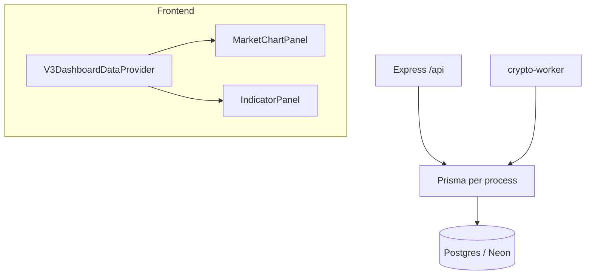

# VPS audit and fix plan (chuyen-gia-crypto)

**Repository:** `/home/ubuntu/chuyen-gia-crypto`

**Audit scope note:** Initial sections combine static code analysis with the implementation work tracked in this repo. **Appendix A** records VPS runtime commands executed during doc creation (see timestamps in shell output).

---

## 1. Executive summary

The deployment exhibited three tightly coupled failure modes visible in code: **(A)** a redundant `useEffect` in `MarketChartPanel` that depended on a non-memoized `refresh` function, which could cause **repeated `/api/market/*` calls** and UI loading flicker; **(B)** the v3 dashboard mounted **multiple independent copies** of the same hooks (`useDashboardSummary` x3, `useAccountData` x4, `useIntelligenceData` x5), each firing parallel `fetch` batches, which **amplified Prisma load** on every dashboard load; **(C)** `IndicatorPanel` and `MarketChartPanel` each called `useMarketData` with **different timeframes** (chart user-selectable vs indicators fixed `15m`), so the UI could show **inconsistent** market state. Testnet balances show zeros when `getTestnetAccount` finds no row—`/api/account/balance` returns explicit zeros rather than an error. Infrastructure risk: **two PM2 processes** (`crypto-api` + `crypto-worker`) each use Prisma; against Neon `connection_limit=3`, timeouts are likely under burst load.

**Implemented mitigations (this pass):** shared `V3DashboardDataProvider` with single fetch streams per category; `useMarketData` stabilized with `useCallback` and duplicate chart `useEffect` removed; shared chart timeframe for chart + indicators; Prisma client `datasources.db.url` resolver appends configurable `connection_limit` for production.

---

## 2. Current status by component

| Component | Data source | Working (code-level) | Mock / partial | Loop / duplicate risk | Contract |
|-----------|-------------|----------------------|----------------|----------------------|----------|
| **SystemOverview** | `useDashboardSummary` → `/api/dashboard/system` | Real DB ping + Prisma reads if API healthy | N/A | **Mitigated:** single provider fetch | Matches `systemBody.data` shape |
| **SchedulerStatusPanel** | `useDashboardSummary` → `/api/dashboard/schedulers` | Inferred from DB timestamps | Heuristic from last rows | **Mitigated** | OK |
| **CandleWarmupPanel** | `useDashboardSummary` → `/api/dashboard/warmup` | Real `ohlcvCandle.count` | N/A | **Mitigated** | OK |
| **MarketChartPanel** | `useMarketData` | Real candles/indicators/signals | `PriceChart` synthetic Fib when `analysis?.indicators` missing | **Fixed:** no duplicate refresh effect; stable `refresh` | Timeframe synced with Indicator via provider |
| **IndicatorPanel** | `useMarketData` | Same APIs as chart | Same as chart | **Mitigated** | Matches chart timeframe |
| **TestnetBalancePanel** | `useAccountData` → `/api/account/balance` | Real if `testnet_accounts` row exists | Zeros when no account | **Mitigated** | OK shape |
| **OpenPositionsPanel** | `useAccountData` | DB `testnetPosition` | Empty array if none | **Mitigated** | `open`/`OPEN` |
| **ActiveOrdersPanel** | `useAccountData` | DB `testnetPendingOrder` | Empty if none | **Mitigated** | `pending`/`PENDING` |
| **TradeHistoryPanel** | `useAccountData` | Closed positions as trades | N/A | **Mitigated** | OK |
| **SignalGatePanel** | `useIntelligenceData` | `tradeDecision` rows | Not dedicated signal-gate table | **Mitigated** | `reasonCodes` from backend |
| **NoTradeReasonsPanel** | `useIntelligenceData` | Aggregated `no_trade` | N/A | **Mitigated** | OK |
| **RiskEnginePanel** | `useIntelligenceData` | Policy + `testnetAccount` | `allowedReason` mirrors lock in API | **Mitigated** | See backend P1 for semantics |
| **LlmDispatchPanel** | `useIntelligenceData` | Heuristic from decisions + env | `responseStatus` heuristic | **Mitigated** | OK |
| **MemoryInsightsPanel** | `useIntelligenceData` | decisions + stats + reflections | “Similar” = last 3 decisions | **Mitigated** | OK |
| **EventLogFeed** | `useEventLogs` | Merged events + decisions | N/A | Single instance | OK |

**Hooks (after provider)**

| Hook | Poll interval | Loop risk | Notes |
|------|---------------|-----------|-------|
| **useDashboardSummary** | Once per provider mount | Low | Single shared state |
| **useMarketData** | `[symbol,timeframe]` via provider | Low | `useCallback` on fetch |
| **useAccountData** | Once per provider mount | Low | Single shared state |
| **useIntelligenceData** | Once per provider mount | Low | Single shared state |
| **useEventLogs** | `[module,limit]` | Low | Unchanged |

---

## 3. Backend findings

- **Prisma client** (`backend/src/lib/prisma.ts`): Production pool pressure from duplicate frontend requests; **mitigated** on client + optional `PRISMA_CONNECTION_LIMIT` / URL `connection_limit` merge for each process.
- **Dashboard `/warmup`**: Four parallel `count` queries; bounded; duplicate frontend removed.
- **Market `/candles` and `/indicators`**: Both call `getOhlcvCandles` → `prisma.ohlcvCandle.findMany`; duplicate chart loop removed; single market consumer per page.
- **Testnet balance**: Missing account returns success + zeros—document as P1 product behavior if UX should distinguish “unconfigured”.
- **Risk** (`/api/dashboard/risk`): `allowedReason: lockReason`—semantic P1 if copy is confusing.
- **Metrics** `/api/metrics/no-trade`: Placeholder empty array—P2 if still referenced.
- **Worker market scan**: Simplified OHLC from spot price—data quality P1 separate from pool.

---

## 4. Frontend findings

- **P0 – Chart refresh loop:** Fixed by removing redundant `useEffect` in `MarketChartPanel` and `useCallback` for `fetchData` in `useMarketData`.
- **P0 – Request multiplication:** Fixed via `V3DashboardDataProvider` wrapping the v3 dashboard column grid.
- **P1 – Timeframe desync:** Fixed by lifting timeframe in provider; `IndicatorPanel` uses shared timeframe (props `timeframe` removed from panel API in favor of context).
- **P2 – Console noise:** `PriceChart` `console.log` in `useMemo`—still present; optional cleanup later.
- **P2 – Synthetic overlay:** Kim Nghia fib fallback when no analysis—still present.

---

## 5. Database findings

Run on VPS when investigating data gaps:

```sql
SELECT COUNT(*) FROM ohlcv_candles WHERE coin = 'BTC';
SELECT timeframe, COUNT(*) FROM ohlcv_candles WHERE coin = 'BTC' GROUP BY 1;
SELECT * FROM testnet_accounts WHERE symbol = 'BTC' AND method_id = 'kim_nghia';
SELECT COUNT(*) FROM testnet_positions WHERE status IN ('open','OPEN');
```

See **Appendix A** for command results from the environment where this file was generated.

---

## 6. API contract findings

- Dashboard routes mostly `{ ok: true, data }`; some errors use `{ success: false }` vs `{ ok: false }`—P2 consistency.
- `useMarketData` expects `candles`, `indicators.latest`, `signals`—matches `market.ts`.
- `useAccountData` uses `balanceData.data` with fallback zeros—masks “no account” vs real zero balance (P1 UX).

---

## 7. Root cause analysis



1. **Unstable `refresh` + redundant effect** → repeated market routes (addressed).
2. **Hook duplication** → request storm (addressed via provider).
3. **Small DB pool + two processes** → timeouts under burst (mitigated via `PRISMA_CONNECTION_LIMIT` + fewer concurrent requests).
4. **Missing `testnetAccount` row** → zero payload (unchanged behavior; document or fix in follow-up).
5. **Separate market consumers** → duplicate candle queries (addressed via single market slice in provider).

---

## 8. Fix priorities (counts)

| Priority | Count | Rationale |
|----------|-------|-----------|
| **P0** | 4 | Chart loop; duplicate-hook storm; pool tuning; candle amplification |
| **P1** | 5 | Testnet row/sync; timeframe sync; risk `allowedReason`; empty account UX; worker candle quality |
| **P2** | 4 | PriceChart logs; synthetic fib; metrics placeholder; error envelope consistency |

---

## 9. File-by-file fix plan

### Done in this implementation

| File | Change |
|------|--------|
| `frontend/app/contexts/V3DashboardDataContext.tsx` | **New:** single-flight fetches for summary, account, intelligence; shared market timeframe + `useMarketData` logic with stable `refresh`. |
| `frontend/app/lib/v3DashboardFetchers.ts` | **New:** shared async loaders + `readOkJson` / `mapSignal`. |
| `frontend/app/hooks/useDashboardSummary.ts` | Delegates to `useV3Dashboard().summary`. |
| `frontend/app/hooks/useAccountData.ts` | Delegates to `useV3Dashboard().account`. |
| `frontend/app/hooks/useIntelligenceData.ts` | Delegates to `useV3Dashboard().intelligence`; re-exports types. |
| `frontend/app/hooks/useMarketData.ts` | Delegates to `useV3Dashboard().market` + timeframe controls; legacy standalone path if context missing. |
| `frontend/app/sections/MarketChartPanel.tsx` | Removed duplicate `useEffect`; uses `timeframe` / `setTimeframe` from `useMarketData`. |
| `frontend/app/sections/IndicatorPanel.tsx` | Uses `useMarketData(symbol)` only (shared timeframe). |
| `frontend/app/page.tsx` | Wraps v3 dashboard columns in `V3DashboardDataProvider`. |
| `backend/src/lib/prisma.ts` | `resolveDatabaseUrl()` + `datasources.db.url` for optional `PRISMA_CONNECTION_LIMIT`. |
| `backend/.env.example` | Documents `PRISMA_CONNECTION_LIMIT`. |

### Follow-up (not done here)

- `backend/src/routes/dashboard.ts` `/balance` create-or-configure testnet account; `/risk` `allowedReason` semantics.
- `frontend/app/components/crypto/PriceChart.tsx` remove `console.log`; clarify synthetic fib UX.
- `backend/src/routes/metrics.ts` implement `/metrics/no-trade` or mark deprecated.

---

## 10. Verification checklist

1. `pm2 status` — `crypto-api`, `crypto-worker` running.
2. `tail -n 200 backend/logs/api-error.log` — pool errors vs dashboard loads.
3. Browser Network — count `/api/*` on one page load (expect far fewer duplicate URLs).
4. `curl -s 'http://127.0.0.1:3000/api/account/balance?symbol=BTC&method=kim_nghia' | jq`
5. SQL row checks (Section 5).
6. Switch chart timeframe — one triplet of market requests per change; no idle loop.
7. Five rapid full page reloads — no Prisma timeout.

---

## Appendix A — VPS runtime snapshot

Captured on the deployment host while implementing this plan (2026-05-15).

### PM2

```
pm2 status → crypto-api online (pid 175522); crypto-worker online (pid 175529); restart counts 26 / 27.
```

### HTTP (Express API on port 3000)

```bash
curl -s http://127.0.0.1:3000/api/health
# {"status":"ok","timestamp":"2026-05-15T01:12:42.784Z"}

curl -s 'http://127.0.0.1:3000/api/account/balance?symbol=BTC&method=kim_nghia'
# {"ok":true,"success":true,"data":{"totalBalance":0,"availableBalance":0,"equity":0,"usedMargin":0,"freeMargin":0,"dailyPnL":0,"weeklyPnL":0}}
```

Zeros align with **no** `testnet_accounts` row for `(BTC, kim_nghia)` (Prisma check below).

### Prisma / database (read-only script)

```json
{
  "btcCandles": 1465,
  "byTimeframe": [
    { "_count": 113, "timeframe": "4h" },
    { "_count": 1239, "timeframe": "15m" },
    { "_count": 113, "timeframe": "1h" }
  ],
  "testnetAccount": null
}
```

### Log excerpt (`backend/logs/api-error.log`)

Repeated lines at `2026-05-14T16:00:11` include:

- `Timed out fetching a new connection from the connection pool` (`connection limit: 3`, pool timeout 10s)
- `Invalid prisma.ohlcvCandle.findMany() invocation` immediately following pool timeouts

This matches the pre-fix hypothesis of pool exhaustion under bursty dashboard + market routes.
